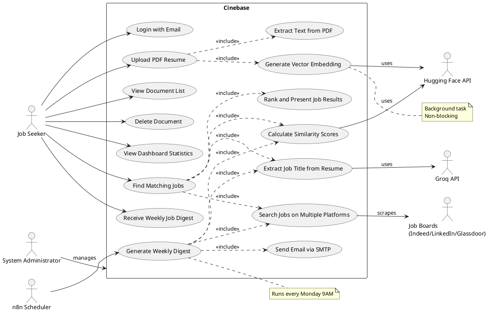
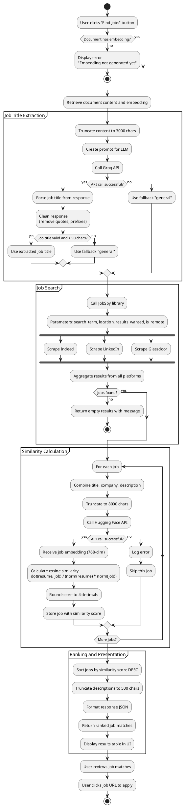
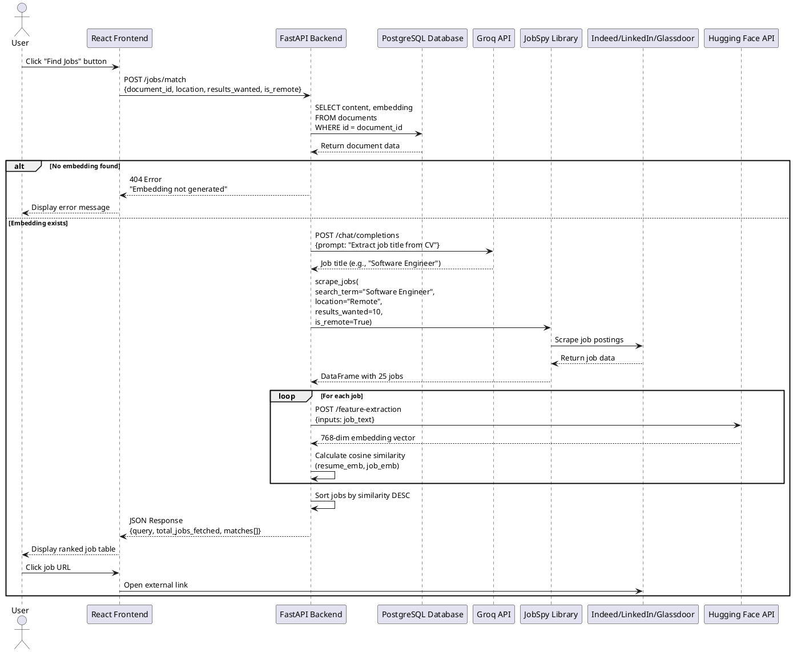
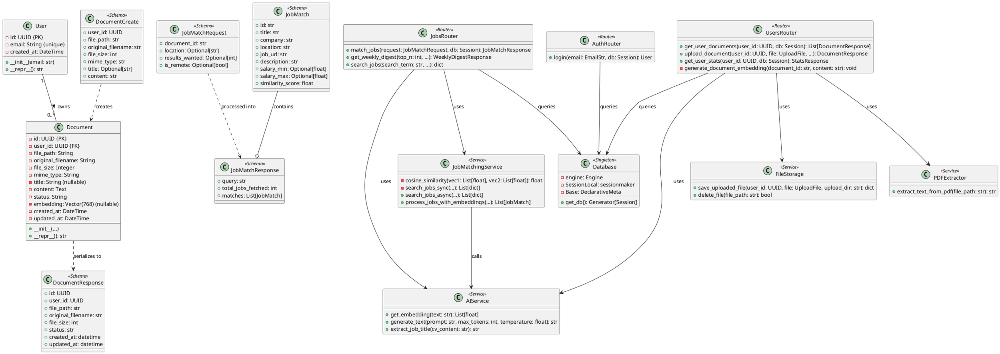
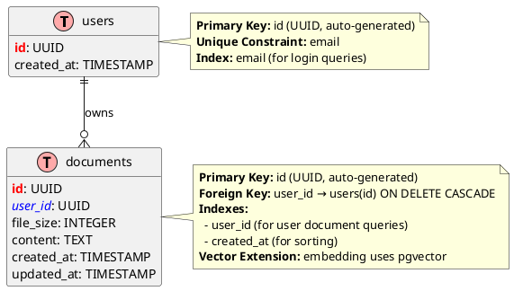

# Section 4: UML Diagrams

This section contains all UML diagrams for the Cinebase application. Each diagram is provided in PlantUML format.

## 4.1 Use Case Diagram

**File:** `usecase_diagram.puml`



---

## 4.2 Activity Diagram - Document CRUD Operations

**File:** `activity_document_crud.puml`

```plantuml
@startuml Document CRUD Operations
start

:User logs in with email;

if (Email exists in database?) then (yes)
  :Retrieve user data;
else (no)
  :Create new user record;
endif

:Display dashboard;

partition "Document Upload" {
  :User selects PDF file;

  if (File type is PDF?) then (no)
    :Display error "Only PDF files allowed";
    stop
  else (yes)
  endif

  if (File size < 10 MB?) then (no)
    :Display error "File too large";
    stop
  else (yes)
  endif

  :Upload file to server;
  :Save file to user directory;
  :Extract text content using pypdf;

  if (Extraction successful?) then (yes)
    :Store text in database;
    :Set status = "processed";
  else (no)
    :Store error message;
  endif

  :Create document record;
  :Return success response;

  fork
    :Start background task;
    :Truncate text to 8000 chars;
    :Call Hugging Face API;

    if (API call successful?) then (yes)
      :Receive 768-dim vector;
      :Store embedding in database;
    else (no)
      :Log error;
    endif
  end fork

  :Display document in list;
}

partition "Document Viewing" {
  :User views dashboard;
  :Query documents WHERE user_id = current_user;
  :Display document list\n(filename, date, size, status);
}

partition "Document Deletion" {
  :User clicks delete button;

  if (User owns document?) then (no)
    :Display error "Unauthorized";
    stop
  else (yes)
  endif

  :Delete file from storage;
  :Delete database record;
  :Display success message;
  :Refresh document list;
}

stop
@enduml
```



---

## 4.3 Activity Diagram - Job Matching, Filtering, and Ranking

**File:** `activity_job_matching.puml`



---

## 4.4 Sequence Diagram - Job Matching Process

**File:** `sequence_job_matching.puml`



---

## 4.5 Class Diagram

**File:** `class_diagram.puml`



---

## 4.6 Entity Relationship Diagram (ERD)

**File:** `erd_diagram.puml`



---

## 4.7 Converting PlantUML to PDF

To convert these diagrams to PDF format:

**Method 1: Command Line (Linux/Mac)**
```bash
# Install PlantUML
sudo apt-get install plantuml  # Ubuntu/Debian
brew install plantuml          # macOS

# Convert to PDF
plantuml -tpdf usecase_diagram.puml
plantuml -tpdf activity_document_crud.puml
plantuml -tpdf activity_job_matching.puml
plantuml -tpdf sequence_job_matching.puml
plantuml -tpdf class_diagram.puml
plantuml -tpdf erd_diagram.puml
```

**Method 2: Online Tool**
1. Visit http://www.plantuml.com/plantuml/uml/
2. Paste the PlantUML code
3. Click "Submit"
4. Download as PDF

**Method 3: VS Code Extension**
1. Install "PlantUML" extension in VS Code
2. Open `.puml` file
3. Press `Alt+D` to preview
4. Right-click preview → Export → PDF

---

**End of Section 4: UML Diagrams**
